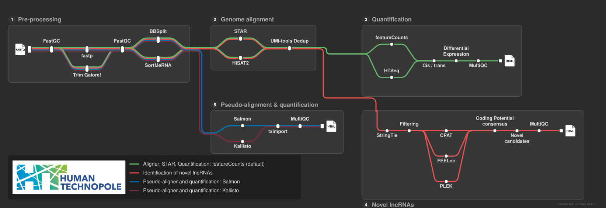

# nfdata-omics lncrna

[](https://github.com/codespaces/new/nfdata-omics/lncrna)
[](https://github.com/nfdata-omics/lncrna/actions/workflows/nf-test.yml)
[](https://github.com/nfdata-omics/lncrna/actions/workflows/linting.yml)[](https://doi.org/10.5281/zenodo.XXXXXXX)
[](https://www.nf-test.com)

[](https://www.nextflow.io/)
[](https://github.com/nf-core/tools/releases/tag/3.5.1)
[](https://docs.conda.io/en/latest/)
[](https://www.docker.com/)
[](https://sylabs.io/docs/)
[](https://cloud.seqera.io/launch?pipeline=https://github.com/nfdata-omics/lncrna)

## Introduction

**nfdata-omics/lncrna** is a bioinformatics pipeline for RNA-seq analysis focused on long non-coding RNAs (lncRNAs). It supports both quantification of known lncRNAs and, optionally, discovery of novel lncRNA candidates. The workflow covers read QC and preprocessing, alignment, transcript assembly, novelty filtering, coding-potential assessment, genomic-context classification, expression quantification, and final reporting.

By default, the pipeline runs in `known-only-lncrnas` mode. When the discovery branch is enabled, it additionally identifies novel candidates, evaluates their coding potential, and generates a final lncRNA assessment.



- Read QC with [FastQC](https://www.bioinformatics.babraham.ac.uk/projects/fastqc/), trimming with [fastp](https://github.com/OpenGene/fastp) or [Trim Galore](https://www.bioinformatics.babraham.ac.uk/projects/trim_galore/), and optional rRNA removal with [SortMeRNA](https://github.com/sortmerna/sortmerna)
- Alignment with [STAR](https://github.com/alexdobin/STAR) or [HISAT2](https://github.com/DaehwanKimLab/hisat2), with BAM processing and alignment statistics via [samtools](https://www.htslib.org/)
- Transcript assembly and merge with [StringTie](https://ccb.jhu.edu/software/stringtie/) and novelty comparison with [gffcompare](https://ccb.jhu.edu/software/stringtie/gffcompare.shtml)
- Expression quantification with [featureCounts](https://subread.sourceforge.net/featureCounts.html) and pseudo-alignment-based quantification with [Salmon](https://combine-lab.github.io/salmon/)
- Optional novel lncRNA identification using coding-potential tools such as [CPAT](https://github.com/liguowang/cpat), [FEELnc](https://github.com/tderrien/FEELnc), and [PLEK](https://sourceforge.net/projects/plek/files/)
- Final HTML reporting and aggregated QC with [MultiQC](https://github.com/MultiQC/MultiQC)

<!-- Add a tube map or workflow figure here if desired -->

## Usage

> [!NOTE]
> If you are new to Nextflow and nf-core, please refer to [this page](https://nf-co.re/docs/usage/installation) on how to set up Nextflow. Test your setup with `-profile test` before running on actual data.

Prepare a samplesheet CSV:

```csv
sample,fastq_1,fastq_2
CTRL_1,/data/CTRL_1_R1.fastq.gz,/data/CTRL_1_R2.fastq.gz
```

Run in known‑only mode (default):

```bash
nextflow run main.nf \
  --input samplesheet.csv \
  --fasta /path/to/genome.fa \
  --gtf /path/to/genes.gtf \
  --outdir /path/to/output \
  -profile conda \
  -resume
```

Enable novel lncRNA discovery:

```bash
nextflow run main.nf \
  --input samplesheet.csv \
  --fasta /path/to/genome.fa \
  --gtf /path/to/genes.gtf \
  --outdir /path/to/output_novel \
  --novel_lncrnas true \
  -profile conda \
  -resume
```

> [!WARNING]
> Provide pipeline parameters via the CLI or Nextflow `-params-file`. Custom config files (`-c`) can adjust executor and resource configuration but should not define parameters; see [docs](https://nf-co.re/docs/usage/getting_started/configuration#custom-configuration-files).

## Credits

nfdata-omics/lncrna was originally written by K. Ruiz-Ceja, M. Bonfanti....

We thank the following people for their extensive assistance in the development of this pipeline:

<!-- TODO nf-core: If applicable, make list of people who have also contributed -->

## Contributions and Support

If you would like to contribute to this pipeline, please see the [contributing guidelines](.github/CONTRIBUTING.md).

## Citations

<!-- TODO nf-core: Add citation for pipeline after first release. Uncomment lines below and update Zenodo doi and badge at the top of this file. -->
<!-- If you use nfdata-omics/lncrna for your analysis, please cite it using the following doi: [10.5281/zenodo.XXXXXX](https://doi.org/10.5281/zenodo.XXXXXX) -->

A bibliography of the tools and data used by the pipeline is available in [`CITATIONS.md`](CITATIONS.md).

This pipeline uses code and infrastructure developed and maintained by the [nf-core](https://nf-co.re) community, reused here under the [MIT license](https://github.com/nf-core/tools/blob/main/LICENSE).

> **The nf-core framework for community-curated bioinformatics pipelines.**
>
> Philip Ewels, Alexander Peltzer, Sven Fillinger, Harshil Patel, Johannes Alneberg, Andreas Wilm, Maxime Ulysse Garcia, Paolo Di Tommaso & Sven Nahnsen.
>
> _Nat Biotechnol._ 2020 Feb 13. doi: [10.1038/s41587-020-0439-x](https://dx.doi.org/10.1038/s41587-020-0439-x).
