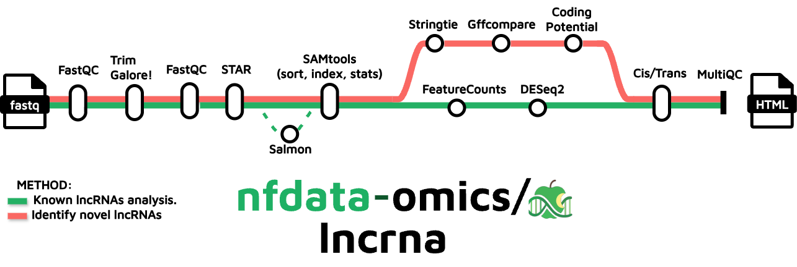

<h1>
  <picture>
    <source media="(prefers-color-scheme: dark)" srcset="docs/images/nfdata-omics-lncrna_logo.png">
    
  </picture>
</h1>

[](https://github.com/codespaces/new/nfdata-omics/lncrna)
[](https://github.com/nfdata-omics/lncrna/actions/workflows/nf-test.yml)
[](https://github.com/nfdata-omics/lncrna/actions/workflows/linting.yml)[](https://doi.org/10.5281/zenodo.XXXXXXX)
[](https://www.nf-test.com)

[](https://www.nextflow.io/)
[](https://github.com/nf-core/tools/releases/tag/3.5.1)
[](https://docs.conda.io/en/latest/)
[](https://www.docker.com/)
[](https://sylabs.io/docs/)
[](https://cloud.seqera.io/launch?pipeline=https://github.com/nfdata-omics/lncrna)

## Introduction

**nfdata-omics/lncrna** is a bioinformatics pipeline that processes RNA‑seq data to quantify known lncRNAs and optionally discover novel lncRNAs. It performs FASTQ QC and alignment, transcript assembly and novelty filtering, coding‑potential assessment, genomic‑context classification, and reporting. By default it runs in known‑only-lncrnas mode; enabling the discovery branch adds identification, coding-potential assessment and a final evaluation of lncRNAs.



- FASTQ QC and trimming; optional rRNA removal and filtering
- Alignment and quantification (STAR or HISAT2)
- Transcript assembly (StringTie) and merge
- Pseudo-allignment with Salmon.
- Optional novel lncRNAs identification: Coding-potential (CPAT/FEELnc/PLEK), filter against known lncRNAs, classification.
- Final HTML report and aggregated QC (MultiQC)

<!-- Add a tube map or workflow figure here if desired -->

## Usage

> [!NOTE]
> If you are new to Nextflow and nf-core, please refer to [this page](https://nf-co.re/docs/usage/installation) on how to set up Nextflow. Test your setup with `-profile test` before running on actual data.

Prepare a samplesheet CSV:

```csv
sample,fastq_1,fastq_2
CTRL_1,/data/CTRL_1_R1.fastq.gz,/data/CTRL_1_R2.fastq.gz
```

Run in known‑only mode (default):

```bash
nextflow run main.nf \
  --input assets/samplesheet.csv \
  --fasta /path/to/genome.fa \
  --gtf /path/to/genes.gtf \
  --outdir /path/to/output \
  -profile conda \
  -resume
```

Enable novel lncRNA discovery:

```bash
nextflow run main.nf \
  --input assets/samplesheet.csv \
  --fasta /path/to/genome.fa \
  --gtf /path/to/genes.gtf \
  --outdir /path/to/output_novel \
  --novel_lncrnas true \
  -profile conda \
  -resume
```

> [!WARNING]
> Provide pipeline parameters via the CLI or Nextflow `-params-file`. Custom config files (`-c`) can adjust executor and resource configuration but should not define parameters; see [docs](https://nf-co.re/docs/usage/getting_started/configuration#custom-configuration-files).

## Outputs

### Known lncRNA assessment

- lncrna_gtf_filtering/by_classcode: filtered GTF and classcode stats
- lncrna_final_annotation: final combined annotation and splits
- expression/quantification: per‑sample quantification outputs
- multiqc: aggregated QC report

### Novel lncRNAs discovery

- lncrna_transcript_filtering/transcripts_length: length‑filtered outputs
- lncrna_transcript_filtering/transcripts_exons: exon‑filtered outputs
- lncrna_prediction/cpat: CPAT predictions
- lncrna_prediction/cpat/models: CPAT models when built
- lncrna_prediction/plek and lncrna_prediction/feelnc: tool‑specific outputs
- lncrna_prediction/combined_predictions: consensus results
- expression/matrix: merged count matrix and gene metadata
- lncrna_report: final HTML report and summary text
- multiqc: aggregated QC report

## Credits

nfdata-omics/lncrna was originally written by K. Ruiz-Ceja, M. Bonfanti, ....

We thank the following people for their extensive assistance in the development of this pipeline:

<!-- TODO nf-core: If applicable, make list of people who have also contributed -->

## Contributions and Support

If you would like to contribute to this pipeline, please see the [contributing guidelines](.github/CONTRIBUTING.md).

## Citations

<!-- TODO nf-core: Add citation for pipeline after first release. Uncomment lines below and update Zenodo doi and badge at the top of this file. -->
<!-- If you use nfdata-omics/lncrna for your analysis, please cite it using the following doi: [10.5281/zenodo.XXXXXX](https://doi.org/10.5281/zenodo.XXXXXX) -->

<!-- TODO nf-core: Add bibliography of tools and data used in your pipeline -->

An extensive list of references for the tools used by the pipeline can be found in the [`CITATIONS.md`](CITATIONS.md) file.

This pipeline uses code and infrastructure developed and maintained by the [nf-core](https://nf-co.re) community, reused here under the [MIT license](https://github.com/nf-core/tools/blob/main/LICENSE).

> **The nf-core framework for community-curated bioinformatics pipelines.**
>
> Philip Ewels, Alexander Peltzer, Sven Fillinger, Harshil Patel, Johannes Alneberg, Andreas Wilm, Maxime Ulysse Garcia, Paolo Di Tommaso & Sven Nahnsen.
>
> _Nat Biotechnol._ 2020 Feb 13. doi: [10.1038/s41587-020-0439-x](https://dx.doi.org/10.1038/s41587-020-0439-x).
